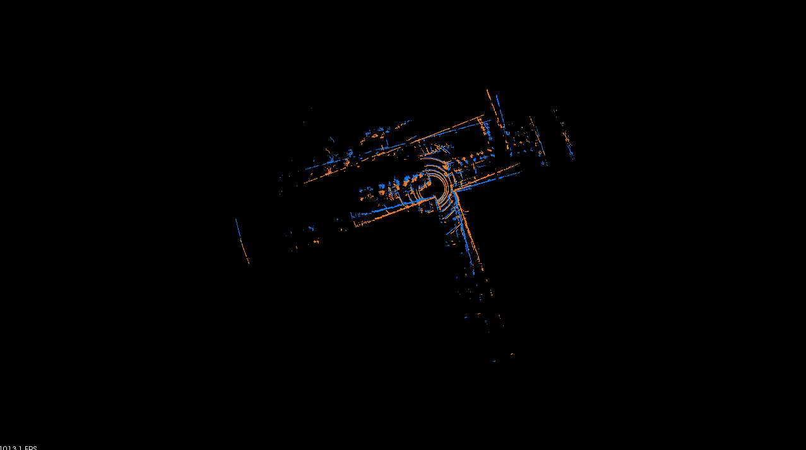
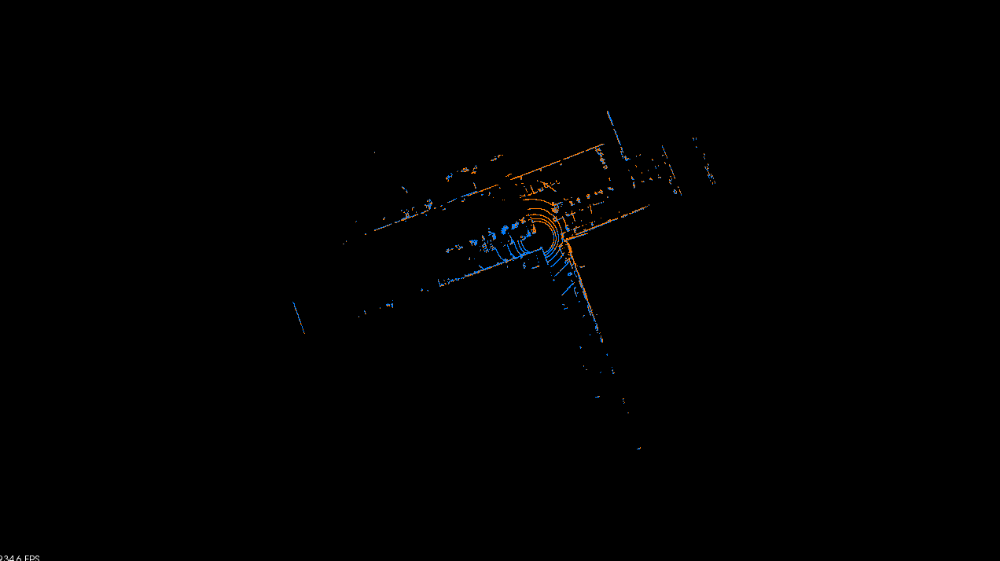
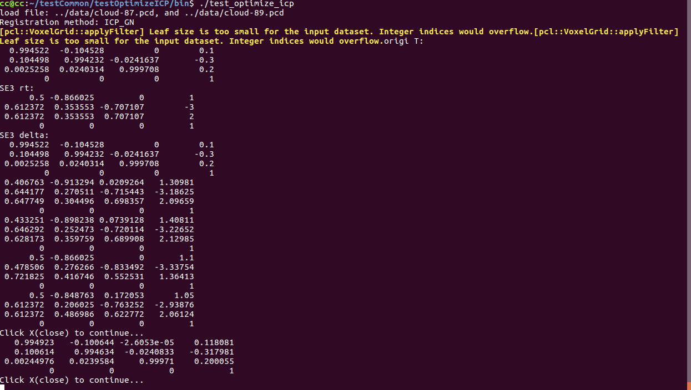

<a href="#"></img></a>
  <a href="#"></img></a>
  <a href="#"></img></a>
  <a href="#"></img></a>
  <a href="https://github.com/chengwei0427/testICP/issues"></img></a>
  <a href="https://github.com/chengwei0427/testICP/graphs/contributors"></img></a>

# testICP
A variety of ICP algorithm implementation, can be used to do comparative testing; Including **ICP, ICP_GN,ICP_SVD,ICP_CERES,ICP_G2O,NDT,SICP,NDT_CPU**;

## Something may not right
[GN,ceres and g2o  left/right perturbation update need further examination]

## Example results 
<p align='center'>
    
    
</p>

<p align='center'>
    
</p>

-[bilibili-video](https://www.bilibili.com/video/BV1Rg411d7zU?spm_id_from=333.999.0.0)

-[csdn](https://blog.csdn.net/u012700322/article/details/124802086?csdn_share_tail=%7B%22type%22%3A%22blog%22%2C%22rType%22%3A%22article%22%2C%22rId%22%3A%22124802086%22%2C%22source%22%3A%22u012700322%22%7D&ctrtid=lFfjN)

## Dependency

-[Eigen]

-[BOOST]

-[PCL]

-[OPENCV]

-[G2o]

-[Ceres]


## Install

Use the following commands to download and compile the package.

```
cd ~/${yourdir}
git clone https://github.com/chengwei0427/testICP.git
cd ./testICP/build
cmake ..
make
```

## Other notes

1. you should change the cmakelist, find the right dependencies; **I think you can finish the work yourself**

2.you could change the **config/config.yaml** to test different ICP method;

## Run the package

```
cd ./bin/
./test_optimize_icp
```

## TODO

  - [x] [add floam use g2o instead of ceres](https://github.com/chengwei0427/floam_g2o)
  - [ ] [Add gicp,vgicp](https://travis-ci.org/SMRT-AIST/fast_gicp)
  - [ ] [Add Comparison]


## Acknowledgements

Thanks shenlan,floam.